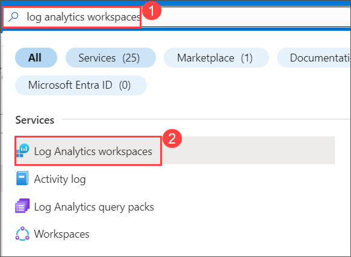
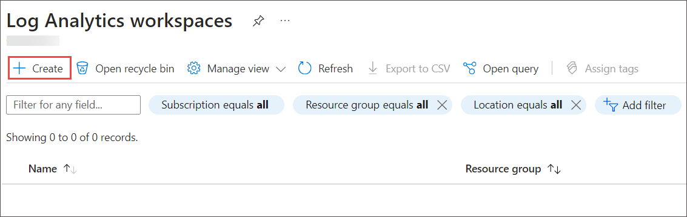
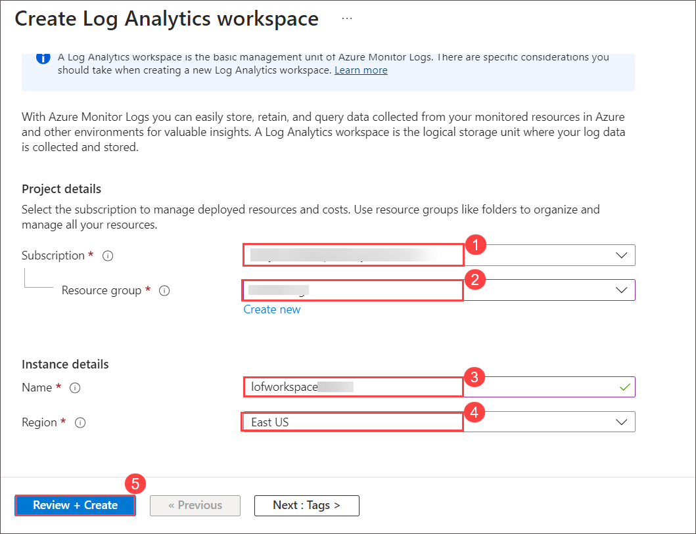
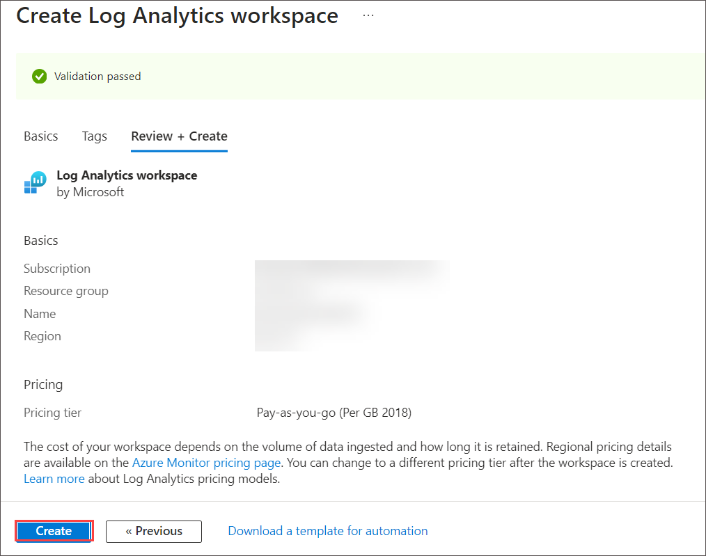
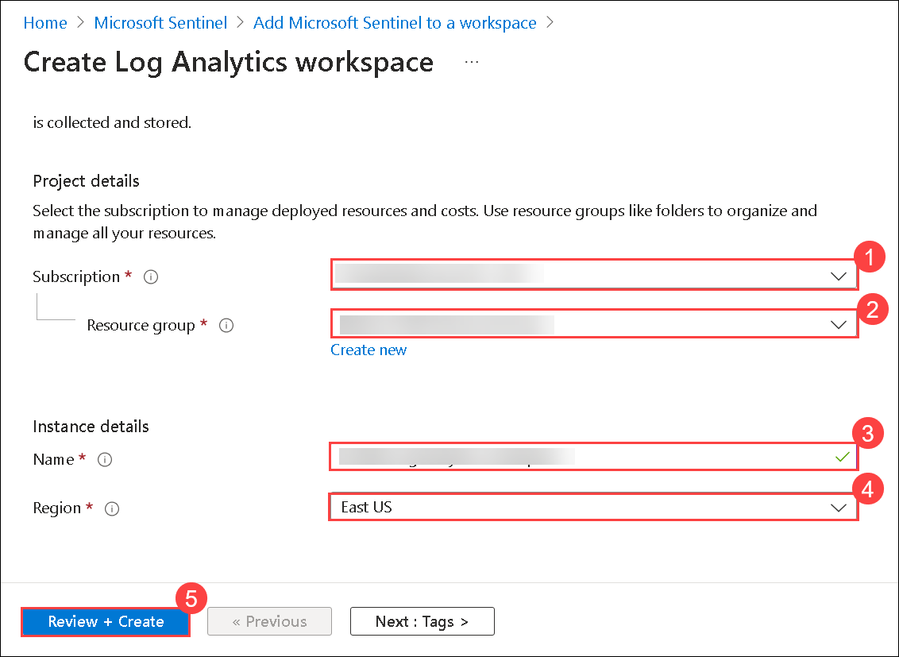
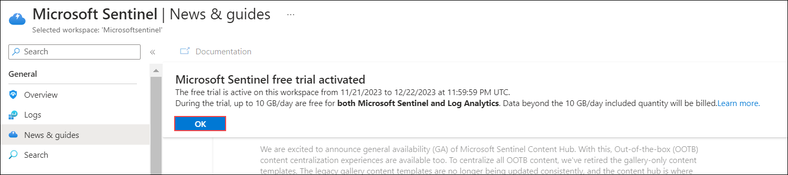
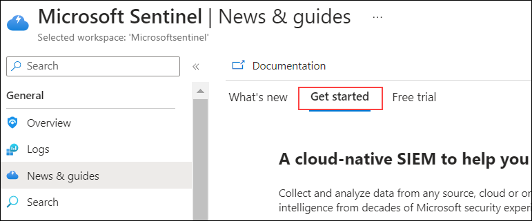

## Lab 01 - Setup Sentinel Environment

## Overview
 You are a Security Operations Analyst working at a company . You will start creating a Log Analytics workspace which is a unique environment for log data from Azure Monitor and other Azure services, such as Microsoft Sentinel and Microsoft Defender for Cloud. You will also create Microsoft Sentinel instance to

## Lab objectives ( Duration: 30 minutes)
In this lab, you will complete the following tasks:
- Task 1: Create a Log Analytics Workspace
- Task 2: Create Sentinel Workspace

## Architecture Diagram

### Task 1: Create a Log Analytics Workspace

In this task, you will create a Log Analytics workspace for use with Microsoft Defender for Cloud.

1. In the Search bar of the Azure portal, type **Log Analytics**, then select **Log Analytics workspaces**.
   
   

1. Select **+ Create** from the command bar.
    
   

1. Select Resource Group from the drop down(sentinel-rg).

1. For the Name, enter something unique like **uniquenameDefender**.

1. Select the default Region. 

1. Select **Review + Create**.

   

1. Once the workspace validation has passed, select **Create**. Wait for the new workspace to be provisioned, this may take a few minutes.

   

### Task 2: Create Sentinel Workspace

In this task, you will create Microsoft Sentinel workspace where you will be monitoring and analyzing security events in upcoming labs.

1. In the Azure portal, in the **Search Bar** search for **Microsoft Sentinel** then select **Microsoft Sentinel** from the search results. 

   

1. From the Microsoft Sentinel page, select **+ Create**.

1. From Add Microsoft Sentinel to a workspace, select **+ Create a new workspace**.

1. From the basics tab of the Create Log Analytics workspace, enter the following

    | Setting | Action |
    | -- | -- |
    | Subscription |  **Select the given subscription (1)**  |
    | Resource group | select ResourceGroup |
    | Name | LogAnalytics-workspace-<inject key="DeploymentID" enableCopy="false"/>** |
    | Region | leave this default |
    |||

    

1. click **Review + Create**.   

1. Verify the information you entered then select **Create**.

1. If you don’t see the new workspace listed, select **Refresh**, then select newly created workspace **LogAnalytics-workspace-<inject key="DeploymentID" enableCopy="false"/> (1)** and click on **Add (2)**.

   .png)

1. Once the new workspace is added, the Microsoft Sentinel | News & guides page will display., including that the Microsoft Sentinel free trial is activated. Select **OK**  Note the three steps listed on the Get started page.

   
   
   

1. Keep this page open, as you will use it in the next task.

## Review
In this lab, you will complete the following tasks:
- Create a Log Analytics Workspace
- Create Sentinel Workspace
