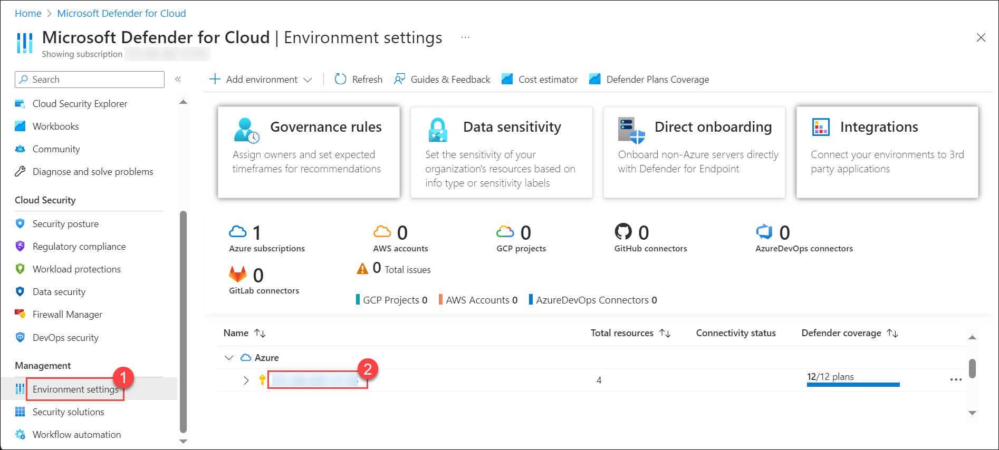

## Lab 02 - Onboard Server Defender for Cloud  

## Lab scenario
In this lab, you will setup Log ingestion from Microsoft Defender for Endpoint is to collect, process, and analyze security event logs from Microsoft Defender for Endpoint to enhance threat detection and response within the organization.

## Lab objectives (Duration: 120 minutes)

In this lab, you will complete the following tasks:
- Task 1: Onboard Server Defender for Cloud 

## Architecture Diagram

### Task 1: Onboard Server to Defender for Cloud 

In this task, you will enable and configure Microsoft Defender for Cloud.

1. In the Search bar of the Azure portal, type *Defender*, then select **Microsoft Defender for Cloud**.

   

1. Click the left menu and click on **Getting started**. On the **Getting Started** page, under the **Upgrade** tab, make sure your subscription is selected and then select the **Upgrade** button at the bottom of the page. It takes about 2 minutes.

    

1. From Defender for Cloud's menu, select Environment settings and select the subscription.

     

1. Review the Azure resources that are now protected with the Defender for Cloud plans.

1. Click on *Defender Plans* on left blade. Then you need to click on *Settings&Monitoring* inbetween the page at top left.

    

1. Review the monitoring extensions. Confirm that **Log Analytics agent/Azure Monitor agent** is **Off**. Close the Settings & monitoring page by selecting the 'X' on the upper right of the page.
   > **Note:** If **Log Analytics agent/Azure 
 Monitor agent** is **On** then change to **Off**. Press continoue on the top of right side then click Save.

   
    
1. To go back to the **Environment settings** and select the '>' to the left of your subscription.

1. Select the Log Analytics workspace you created earlier *LogAnalytics-workspace-*** to review the available options and pricing.

1. Select **Enable all plans** for  services (**servers**) which you want to onboard (to the right of Select Defender plan) and then select **Save**. Wait for the *"Microsoft Defender plan for workspace LogAnalytics-workspace-*** was saved successfully!"* notification to appear.

   

   >**Note:** If the page is not being displayed, refresh your Edge browser and try again and if Plans are already enable no need to change anything.

1. Close the Defender plans page by selecting the 'X' on the upper right of the page to go back to the **Environment settings**

## Review
In this lab, you will complete the following tasks:
- Onboard Server to Defender for Cloud.
