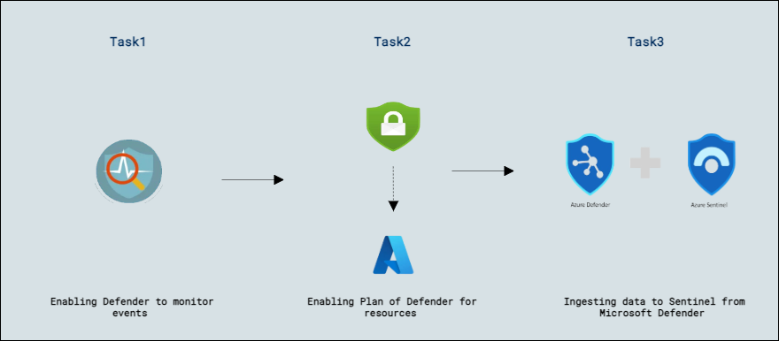
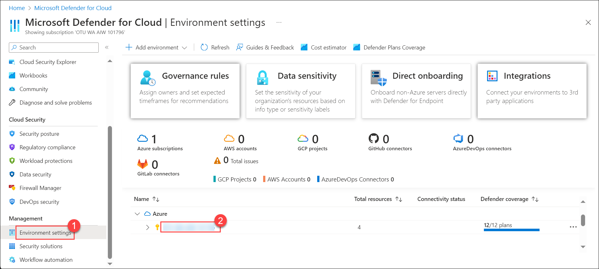
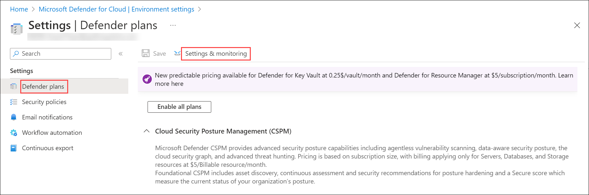
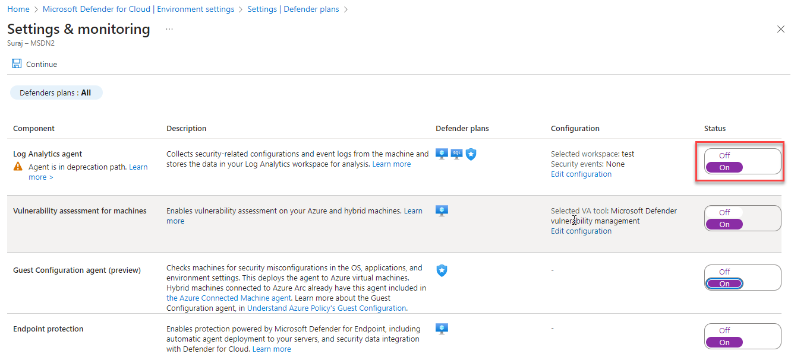
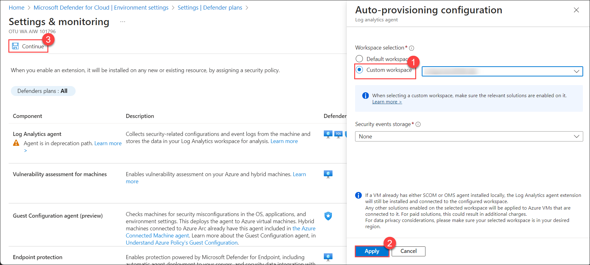
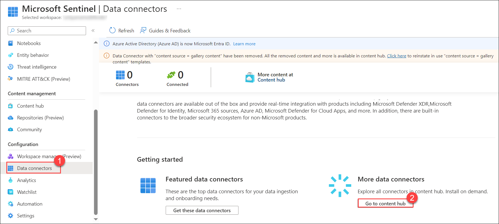
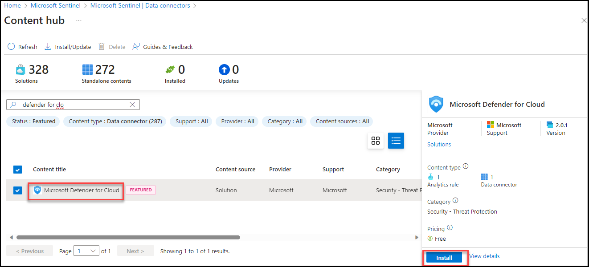

## Lab 04 - Ingest Logs from Microsoft Defender for Cloud

## Lab scenario
The Microsoft 365 Defender portal helps security teams investigate attacks across cloud resources, devices, and identities. In this lab, you will set up Log Analytics workspace in Azure and configure Microsoft Defender for Cloud to ingest security logs into the workspace for monitoring and analysis.

## Lab objectives (Duration: 45 minutes)
In this lab, you will complete the following tasks:
- Task 1: Enabling Defender to monitor events
- Task 2: Enabling Plan of Defender for resources
- Task 3: Ingesting data to Sentinel from Microsoft Defender

## Architecture Diagram
  
  
### Task 1: Enabling Defender to monitor events

In this task, you will explore ingesting logs from Microsoft Defender for Cloud.

1. In the Search bar of the Azure portal, type *Defender*, then select **Microsoft Defender for Cloud**.

1. From Defender for Cloud's menu, select Environment settings and select the subscription.

     

1. Click on *Defender Plans* on left blade. Then you need to click on *Settings&Monitoring* inbetween the page at top left.

    

1. Enable the **Log Analytics agent** which will Collects security-related configurations and event logs from the machine and stores the data in your Log Analytics workspace for analysis.

     >**Note**: If its already enable, no need to change.

   

1. Select **Custom Workspace** then select your workspace Click on **Apply** then **Continue** and click on **Save**.

   

### Task 2: Enabling Plan of Defender for resources

In this task, you will enable the plan for resources on which diagnostics you want to be setup.

1. Enable Microsoft Defender for Cloud on the workspace on which you're installing the Log Analytics agent:

1. From Defender for Cloud's menu, open environment settings.

1. Set the workspace on which you're installing the agent. Make sure the workspace is in the same subscription you use in Defender for       Cloud and that you have read/write permissions for the workspace.

1. Select one or both **Servers** or **SQL servers on machines** (Foundational CSPM is the free default), and then select **Save**.

   

### Task 3: Ingesting data to Sentinel from Microsoft Defender

1. For Microsoft Defender data to ingest to Sentinel you need to use the connectors provided by the Sentinel.

   

1. Now you need to click on install both the conenctor of Microsoft Defender for Cloud and Microsoft 365 Defender to get the logs into the Sentinel

   

## Review
In this lab, you will complete the following tasks:
- Enabling Defender to monitor events
- Enabling Plan of Defender for resources
- Ingesting data to Sentinel from Microsoft Defender
