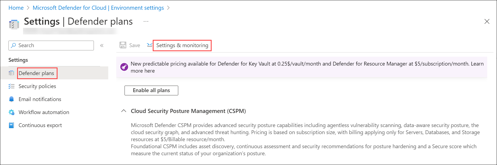
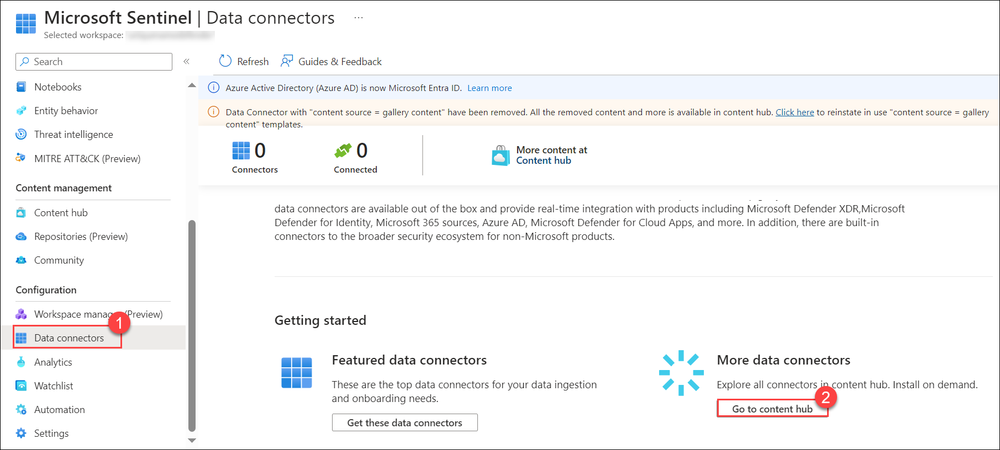
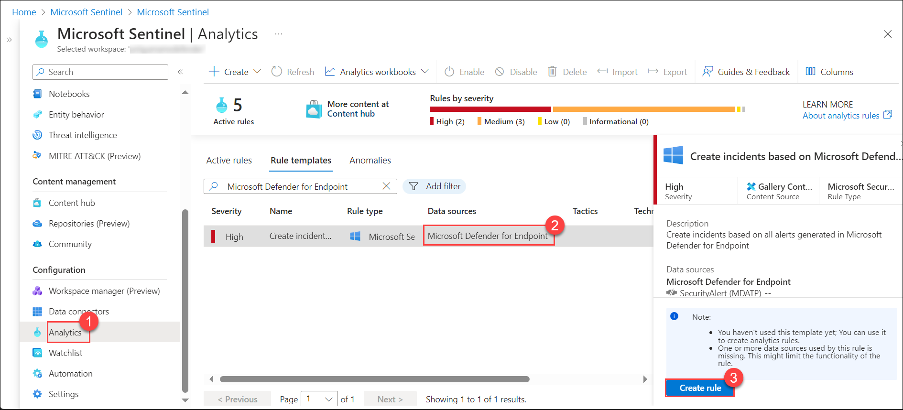

## Lab 05 - Ingest Logs from Microsoft Defender for Endpoint

## Lab scenario
Microsoft Defender for Endpoint is an enterprise endpoint security platform designed to help enterprise networks prevent, detect, investigate, and respond to advanced threats. In this lab, Ingest Logs from Microsoft Defender for Endpoint is to collect, process, and analyze security event logs from Microsoft Defender for Endpoint to enhance threat detection and response within the organization.

## Lab objectives (Duration: 120 minutes)

In this lab, you will complete the following tasks:
- Task 1: Explore defender for ingest data
- Task 2: Verify installation of Defender for Endpoint on a machine
- Task 3: Ingesting data to Sentinel from Microsoft Defender

## Architecture Diagram

   

### Task 1: Explore defender for ingest data 

In this task, you will explore ingesting logs from Microsoft Defender for Cloud.

1. In the Search bar of the Azure portal, type *Defender*, then select **Microsoft Defender for Cloud**.

1. From Defender for Cloud's menu, select Environment settings and select the subscription that you want to receive Defender for Endpoint.

     

1. Click on *Defender Plans* on left blade. Then you need to click on *Settings&Monitoring* inbetween the page at top left.

    

1. In the status of the Endpoint protection component, select **On** to enable the integration with Microsoft Defender for Endpoint. If its already enable then no need to change.

   
   
   > Automatically onboard your Windows machines to Defender for Endpoint, Detect any previous installations of Defender for Endpoint and reconfigure them to integrate with Defender for Cloud.Onboarding might take up to 1 hour.

1. Select Continue and Save to save your settings.

### Task 2: Verify installation of Defender for Endpoint on a machine

1. In your vm search for the **Services**, will find Microsoft Monitoring Agent is Running.

      

### Task 3: Ingesting data to Sentinel from Microsoft Defender for Endpoint 

1. For Microsoft Defender data to ingest to Sentinel you need to use the connectors provided by the Sentinel.

   

1. Now you need to click on install the Microsoft Defender for Endpoint to get the logs into the Sentinel

   

1. Now you need to setup a analytics rule to get alerts as a incident in the Sentinel. Click on **Analytics** and search for *Microsoft Defender for Endpoint* under *Rule templates* select and **Create rule**.
   
   

1. Click on **Automated response** then **Review + create** and click on **Save**. This will create an alert rule.

1. Now you will be able to see the incidents generated by the Microsoft Defender for Endpoint in **incidents** tab once you setup an alert rule.
   >**Note**: It will take time to generate.    

      

## Review
In this lab, you will complete the following tasks:
- Explore defender for ingest data
- Verify installation of Defender for Endpoint on a machine
- Ingesting data to Sentinel from Microsoft Defender for Endpoint
