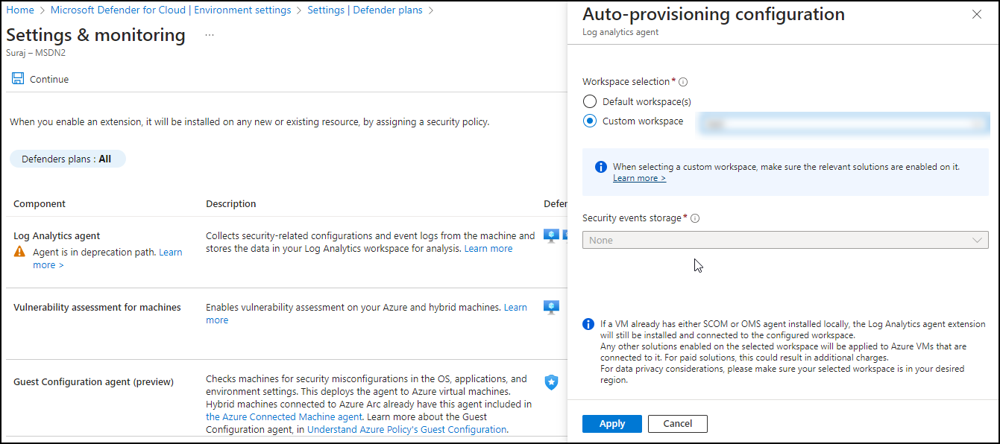

## Lab 06 - Ingest Logs from Microsoft Defender for Cloud

### Task 1: Explore defender for ingest data

In this task, you will explore ingesting logs from Microsoft Defender for Cloud.

1. In the Search bar of the Azure portal, type *Defender*, then select **Microsoft Defender for Cloud**.

1. From Defender for Cloud's menu, open **Environment settings**.

1. Select **Subscription** and click on *Defender Plans* on left blade. Then you need to click on *Settings&Monitoring* inbetween the page at top left.

   

1. Enable the **Log Analytics agent** which will Collects security-related configurations and event logs from the machine and stores the data in your Log Analytics workspace for analysis.

   

   

### Task 2: Enabling Plan of Defender for resources

In this task, you will enable the plan for resources on which diagnostics you want to be setup.

1. Enable Microsoft Defender for Cloud on the workspace on which you're installing the Log Analytics agent:

1. From Defender for Cloud's menu, open environment settings.

1. Set the workspace on which you're installing the agent. Make sure the workspace is in the same subscription you use in Defender for       Cloud and that you have read/write permissions for the workspace.

1. Select one or both **Servers** or **SQL servers on machines** (Foundational CSPM is the free default), and then select **Save**.

  

### Task 3: Disabling or turning of defender monitoring

1. For Defender plans that have monitoring settings, go to the settings of the Defender plan, turn off the extension, and select **Save**
