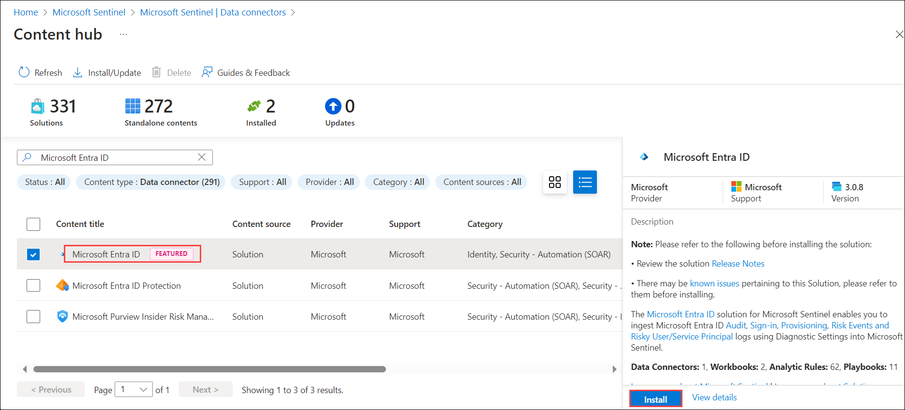
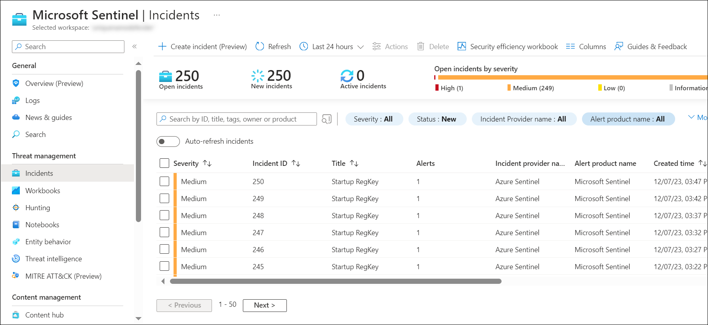

## Lab 06 - Ingest Logs from Microsoft Entra ID

## Lab scenario
Microsoft Entra ID is an integrated cloud identity and access solution. In this lab, you will enable the ingestion of logs from Microsoft Entra ID into Security Information and Event Management (SIEM) solution to enhance security monitoring and analytical capabilities.

## Lab objectives (Duration: 45 minutes)
In this lab, you will complete the following tasks:
- Task 1: Ingesting logs from Microsoft Entra ID to Sentinel

## Architecture Diagram

   

### Task 1: Ingesting logs from Microsoft Entra ID to Sentinel 

In this task, you will explore the Microsoft Sentinel .

1. In the Search bar of the Azure portal, type *Sentinel*, then select **Microsoft Sentinel**.

     

2. Select your Microsoft Sentinel Workspace.

3. Select the **Data Connectors** under **Configuration** and select **Go to content hub**.

     

5. Search for and select the **Microsoft Entra ID** connector. Select the AD connector.

   

6. Click on **Install**.
   
1. Now you need to setup a analytics rule to get alerts as a incident in the Sentinel. Click on **Analytics** and search for *Microsoft Entra ID* under *Rule templates* select and **Create rule**.
   
1. Click on **Automated response** then **Review + create** and click on **Save**. This will create an alert rule.
   
1. Now you will be able to see the incidents generated by the Microsoft Entra ID in **incidents** tab once you setup an alert rule.
   >**Note**: It will take time to generate.    

      
## Review
In this lab we have completed Ingesting logs from Microsoft Entra ID to Sentinel.
