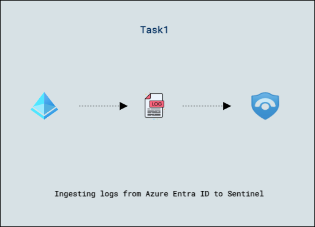

## Part:1 Lab 07 - Ingest Logs from Microsoft Purview

## Lab scenario
Set up log ingestion from Microsoft Purview into a SIEM (Security Information and Event Management) solution for security monitoring and analysis.

## Lab objectives (Duration: 45 minutes)
In this lab, you will complete the following tasks:
- Task 1: Ingesting logs from Microsoft Purview to Sentinel

## Architecture Diagram

   

### Task 1: Ingesting logs from Microsoft Purview to Sentinel 

In this task, you will explore the Microsoft Sentinel .

1. In the Search bar of the Azure portal, type *Sentinel*, then select **Microsoft Sentinel**.

     

2. Select your Microsoft Sentinel Workspace.

3. Select the **Data Connectors** under **Configuration** and select **Go to content hub**.
   
     
   
5. Search for and select the **Microsoft Purview** connector. Select the Microsoft Purview.

   

6. Click on **Install**.

7. In the **incidents** tab, search for **Microsoft Purview**, and you will be able to see a few incidents generated by Microsoft Purview based on the Analytics rule setup.

   

## Review
In this lab we have completed Ingesting logs from Microsoft Purview to Sentinel.
