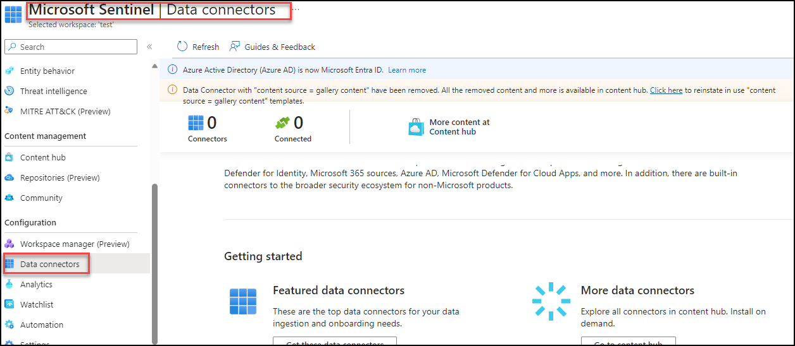
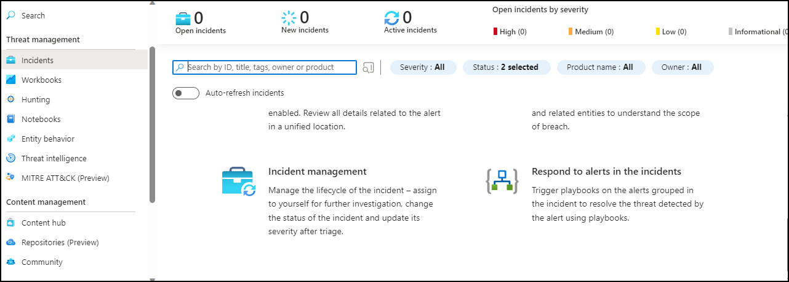
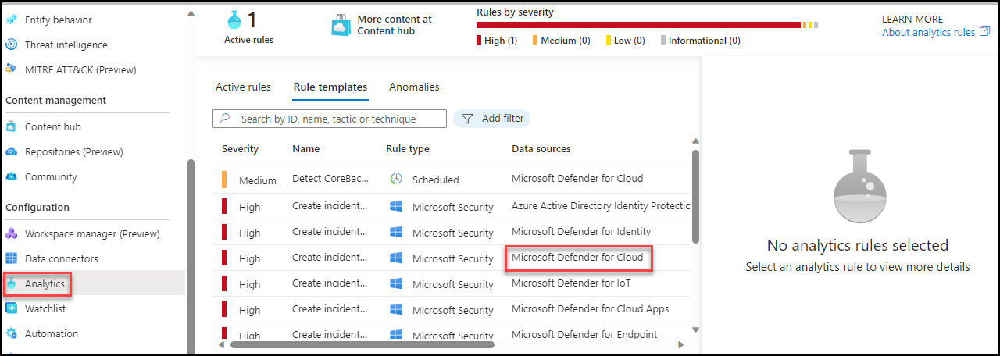

## Lab 07 - Ingest Logs from Microsoft Defender for Endpoint

### Task 1: Explore defender for ingest data

In this task, you will explore ingesting logs from Microsoft Defender for Cloud.

1. In the Search bar of the Azure portal, type *Defender*, then select **Microsoft Defender for Cloud**.

1. From Defender for Cloud's menu, select Environment settings and select the subscription with the Linux machines that you want to receive Defender for Endpoint.


1. In the Monitoring coverage column of the Defender for Server plan, select Settings.

1. In the status of the Endpoint protection component, select On to enable the integration with Microsoft Defender for Endpoint.


Automatically onboard your Windows and Linux machines to Defender for Endpoint, Detect any previous installations of Defender for Endpoint and reconfigure them to integrate with Defender for Cloud.Onboarding might take up to 1 hour.

1. Select Continue and Save to save your settings.


### Task 2: verify installation of Defender for Endpoint on a machine

**Linux**:

```
sudo mdatp health --get
```

**Windows**:

```
Get-MpComputerStatus
```


### Task 3: Ingesting data to Sentinel from Microsoft Defender 

1. For Microsoft Defender data to ingest to Sentinel you need to use the connectors provided by the Sentinel.

   

1. Now you need to click on install the conenctor of Microsoft Defender for Cloud to get the logs into the Sentinel

   

1. you will be able to see the incidents generated by the Microsoft Cloud Defender in **incidents** tab once you setup an alert rule   

   

1. you also need to setup a analytics rule to get alerts as a incident in the Sentinel
   
   
