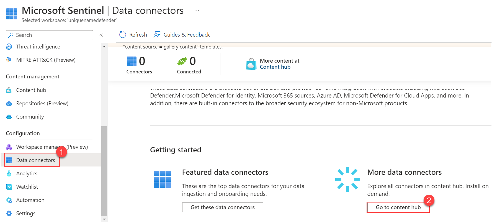

## Lab 07 - Ingest Logs from Microsoft Purview

## Lab scenario

Microsoft Purview is a data governance solution. It helps customers gain deep knowledge of all their data while maintaining control over its use. In this lab, you will implement the setup for logging Microsoft Purview and direct the logs into a Security Information and Event Management (SIEM) platform for comprehensive security monitoring and analysis.

## Lab objectives (Duration: 45 minutes)
In this lab, you will complete the following tasks:
- Task 1: Ingesting logs from Microsoft Purview to Sentinel

## Architecture Diagram

   

### Task 1: Ingesting logs from Microsoft Purview to Sentinel 

In this task, you will explore the Microsoft Sentinel .

1. In the Search bar of the Azure portal, type *Sentinel*, then select **Microsoft Sentinel**.

     

2. Select your Microsoft Sentinel Workspace.

3. Select the **Data Connectors** under **Configuration** and select **Go to content hub**.
   
     
   
5. Search for and select the **Microsoft Purview** connector. Select the Microsoft Purview.

   

6. Click on **Install**.

1. Now you need to setup a analytics rule to get alerts as a incident in the Sentinel. Click on **Analytics** and search for *Microsoft Purview* under *Rule templates* select and **Create rule**.
   
1. Click on **Automated response** then **Review + create** and click on **Save**. This will create an alert rule.
   
1. Now you will be able to see the incidents generated by the Microsoft Purview in **incidents** tab once you setup an alert rule.
   >**Note**: It will take time to generate.    

   

## Review
In this lab we have completed Ingesting logs from Microsoft Purview to Sentinel.
