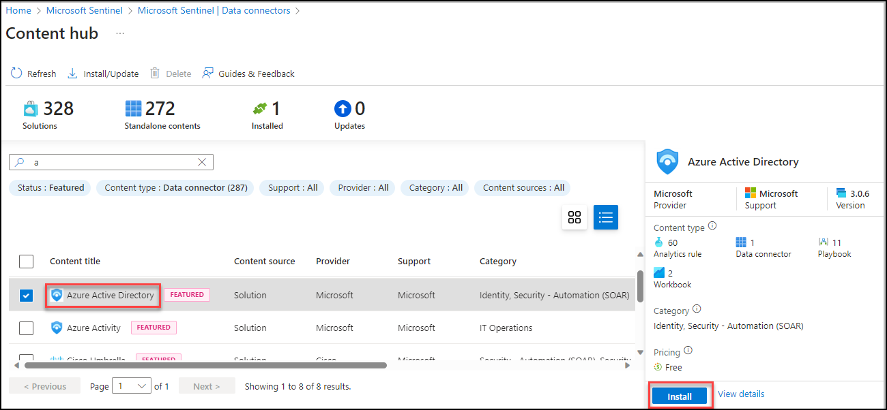

## Lab 08- Ingest Logs from Azure AD

### Task 1: Ingesting logs from Azure AD to Sentinel 

In this task, you will explore the Microsoft Sentinel .

1. In the Search bar of the Azure portal, type *Sentinel*, then select **Microsoft Sentinel**.

    

1. Select your Microsoft Sentinel Workspace.

1. Select the **Data Connectors**.

1. Search for and select the **Azure Active Directory** connector. Select the AD connector.

   

1. Click on **Install**.

1. you will be able to see the incidents generated by Azure AD based on Analytics rule setup in the **incidents** tab

   
