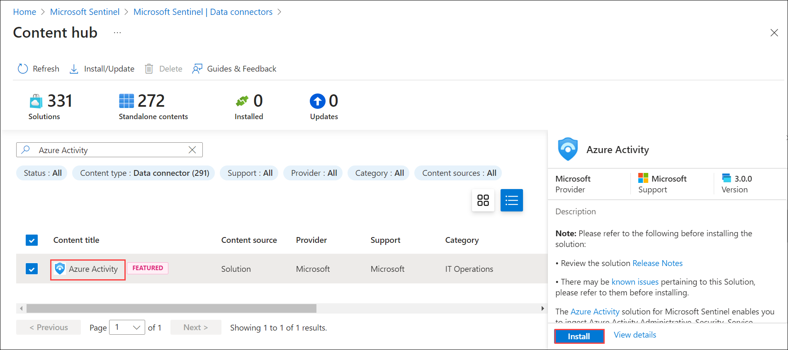

## Lab 10 - Ingest Logs from Microsoft Azure Activity

## Lab scenario

The Azure Monitor activity log is a platform log in Azure that provides insight into subscription-level events. In this lab, you will configure the integration of Microsoft Azure Activity logs with a Security Information and Event Management (SIEM) system to enable thorough security monitoring and analysis.

## Lab objectives (Duration: 45 minutes)
In this lab, you will complete the following tasks:
- Task 1: Ingesting logs from Microsoft Entra ID to Sentinel

## Architecture Diagram

   

### Task 1: Ingesting logs from Microsoft Azure Activity to Sentinel 

In this task, you will explore the Microsoft Sentinel .

1. In the Search bar of the Azure portal, type *Sentinel*, then select **Microsoft Sentinel**.

     

2. Select your Microsoft Sentinel Workspace.

3. Select the **Data Connectors** under **Configuration** and select **Go to content hub**.

    

5. Search for and select the **Azure Activity** connector. Select the AD connector.

   

6. Click on **Install**.

1. Now you need to setup a analytics rule to get alerts as a incident in the Sentinel. Click on **Analytics** and search for *Azure Activity* under *Rule templates* select and **Create rule**.
   
1. Click on **Automated response** then **Review + create** and click on **Save**. This will create an alert rule.
   
1. Now you will be able to see the incidents generated by the Azure Activity in **incidents** tab once you setup an alert rule.
   >**Note**: It will take time to generate.    

    

## Review
In this lab we have completed Ingesting logs from Microsoft Azure Activity to Sentinel.
