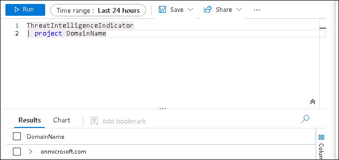

## Lab 11 - Create a Watchlist, Threat Indicator

## Lab scenario

You're a Security Operations Analyst working at a company that is implementing Microsoft Sentinel. You're responsible for setting up the Microsoft Sentinel environment to meet the company requirements to minimize cost, meet compliance regulations, and provide the most manageable environment for your security team to perform their daily job responsibilities.

## Lab objectives (Duration : 20 minutes)
 In this lab, you will perform the following:
- Task 1: Create a Watchlist
- Task 2: Create a Threat Indicator.

## Architecture Diagram  

   

### Task 1: Create a Watchlist

In this task, you will create a watchlist in Microsoft Sentinel.

1. In the search box at the bottom of the Windows 10 screen, enter *Notepad*. Select **Notepad** from the results.

1. Type *Hostname* then enter for a new line.

1. From row 2 of the notepad, copy the following hostnames, each one in a different line:

    ```Notepad
    Host1
    Host2
    Host3
    Host4
    Host5
    ```

1. From the menu select, **File - Save As**, Name the file *HighValue.csv*, change the file type to **All files(*.*)** and select **Save**. **Hint:** The file can be saved in the *Documents* folder.

1. Close Notepad.

1. In Microsoft Sentinel, On the left menu, select the **Watchlist** option under the Configuration area.

1. Select **+ Add new** from the command bar.

1. In the Watchlist wizard, enter the following:

    |General setting|Value|
    |---|---|
    |Name|**HighValueHosts**|
    |Description|**High Value Hosts**|
    |Watchlist alias|**HighValueHosts**|

1. Select, **Next: Source >**.

1. Select **Browse for files** under *Upload file* and browse for the *HighValue.csv* file you just created.

1. In the *SearchKey field* select **Hostname**.

1. Select **Next: Review and Create >**.

1. Review the settings you entered and select **Create**.

1. The screen returns to the Watchlist page.

1. Select the *HighValueHosts* watchlist and on the right pane, select **View in logs**.

    >**Important:** It could take up to ten minutes for the watchlist to appear. **Please continue to with the following task and run this command on the next lab**.
    
    >**Note:** You can now use the _GetWatchlist('HighValueHosts') in your own KQL statements to access the list. The column to reference would be *Hostname*.

1. Close the *Logs* window by selecting the 'x' in the top-right and select **OK** to discard the unsaved edits.

### Task 2: Create a Threat Indicator

In this task, you will create an indicator in Microsoft Sentinel.

1. In Microsoft Sentinel, On the left menu, select the **Threat intelligence** option in the Threat management area.

1. Select **+ Add New** from the command bar.

1. Review the different indicator types available in the *Types* dropdown. Select the **domain-name**. Enter your initials in the Domain box. You can use **onmicrosoft.com**.

1. For the *Threat types*, add **malicious-activity** and select **OK**.

1. For the *Name*, enter the same value used for the Domain. An example would be **onmicrosoft.com**.

1. Set the **Valid from* field to today's date. and **valid till* to next day 

1. Select **Apply**.

    **Note:** It could take a couple of minutes for the indicator to appear.

1. On the left Menu, Select the **Logs** option in the General area. You may need to disable the "Always show queries" option and close the *Queries* window to run the statements.

1. Run the following KQL statement.

    ```KQL
    ThreatIntelligenceIndicator
    ```
    **Note:** You may need to wait for 20 minutes to get the expected output.

    Scroll the results to the right to see the DomainName column. You can also run the following KQL statement to just see the DomainName column.  

    ```KQL
    ThreatIntelligenceIndicator
    | project DomainName
    ```

   


## Review
In this lab, you have completed the following:
- Created a Watchlist
- Created a Threat Indicator.
