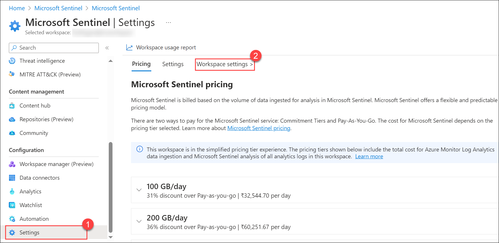

## Lab 12 - Configure Log Retention

## Lab scenario

You are a Security Operations Analyst working at a company that is implementing Microsoft Sentinel. You are responsible for setting up the Microsoft Sentinel environment to meet the company requirement to minimize cost, meet compliance regulations, and provide the most manageable environment for your security team to perform their daily job responsibilities.

## Lab objectives (Duration: 10 minutes)

In this lab, you will complete the following tasks:
- Task 1: Configure Log Retention

### Task 1: Configure Log Retention

In this task, you will change the retention period for the SecurityEvent table.

1. In Microsoft Sentinel, select the **Settings** option in the *Configuration* area.

1. Select **Workspace settings**.

      

1. In Log Analytics workspace, select the **Tables (preview)** option in the *Settings* area.

1. Search and select the table **SecurityEvent**, and then select the ellipsis button (...).

        

1. Select **Manage Table**.

1. Select **180 days** for *Total retention period*. Then **Save**.
