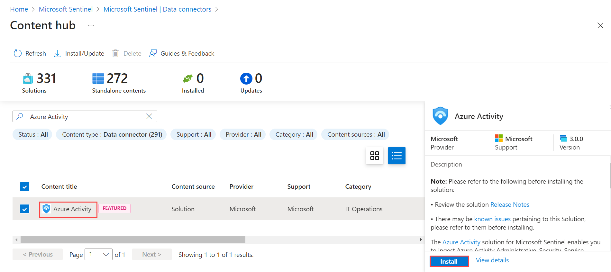

## Part:1 Lab 12 - Ingest Logs from Microsoft Azure Activity

## Lab scenario
Set up log ingestion from Microsoft Azure Activity into a SIEM (Security Information and Event Management) solution for security monitoring and analysis.

## Lab objectives (Duration: 45 minutes)
In this lab, you will complete the following tasks:
- Task 1: Ingesting logs from Microsoft Entra ID to Sentinel

## Architecture Diagram

   

### Task 1: Ingesting logs from Microsoft Azure Activity to Sentinel 

In this task, you will explore the Microsoft Sentinel .

1. In the Search bar of the Azure portal, type *Sentinel*, then select **Microsoft Sentinel**.

     

2. Select your Microsoft Sentinel Workspace.

3. Select the **Data Connectors** under **Configration** and select **Go to content hub**.

    

5. Search for and select the **Azure Activity** connector. Select the AD connector.

   

6. Click on **Install**.

7. you will be able to see the incidents generated by Microsoft Azure Activity based on Analytics rule setup in the **incidents** tab

   

## Review
In this lab we have completed Ingesting logs from Microsoft Azure Activity to Sentinel.
