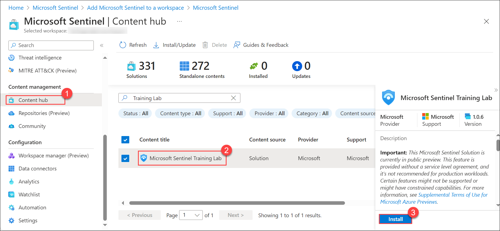
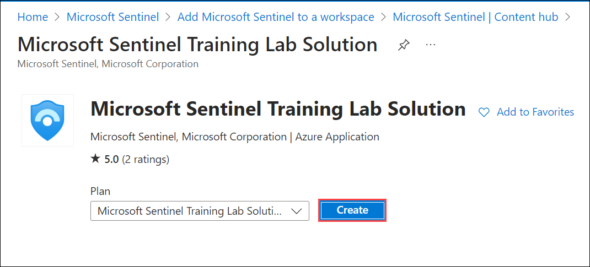
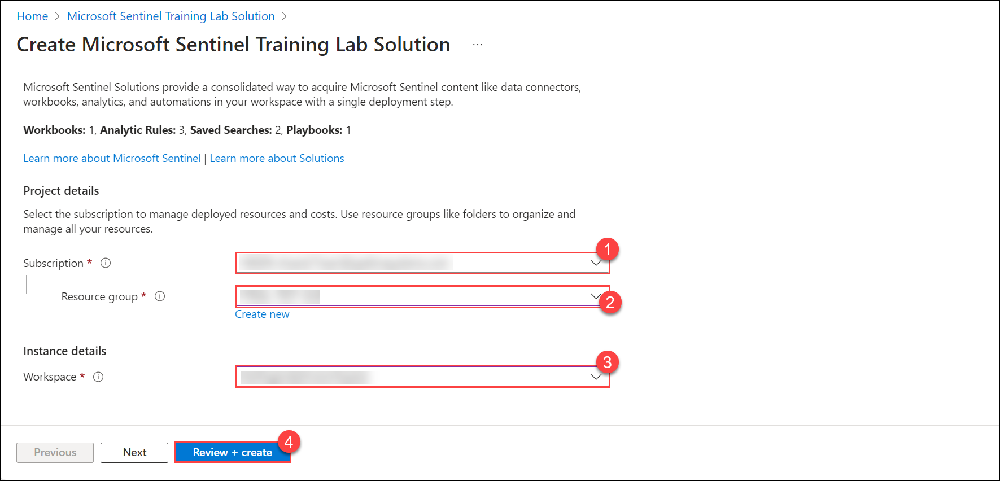
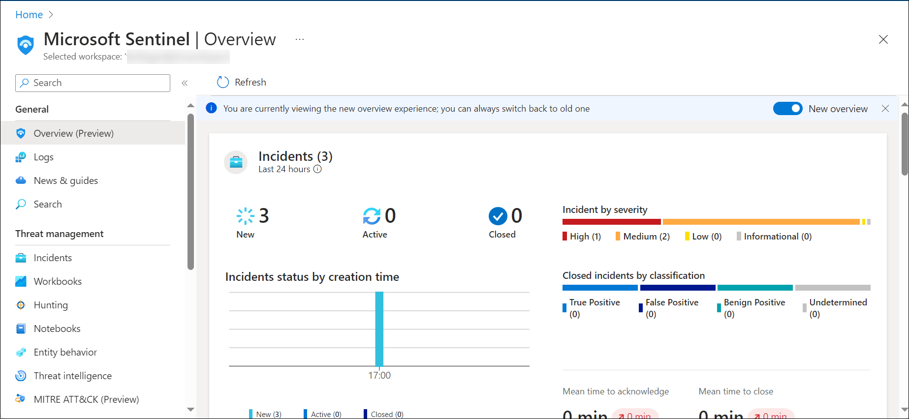

## Lab 13 - Using Sentinel Training Lab 

## Lab scenario

In this lab, you will walk through the process of creating a  Microsoft Sentinel Training Lab Solution. Microsoft Sentinel Training Lab can be used to get ramped up with Microsoft Sentinel and provide hands-on practical experience for product features, capabilities, and scenarios.

## Lab objectives (Duration: 30 minutes)

In this lab, you will complete the following task:

+ Task 1: Using Sentinel Training Lab 

## Task 1:  Using Sentinel Training Lab 

1. In Microsoft Sentinel, select the **Content hub** option in the *Content management* area.

1. From the Microsoft Sentinel page, search **Training Lab**, Select the **Microsoft Sentinel Training Lab**, click **Install**.
   
   

1. It navigate to **Microsoft Sentinel Training Lab Solution** page, Click to **Create**.
   
   

1. In the Basics tab, select the Subscription, Resource Group and Workspac, provide the details for your existing workspace. *Optionally*, review the different tabs (Workbooks, Analytics, Hunting Queries, Watchlists, Playbooks) in the solution. click on **Review + create**.

   

    >**Note:** That the deployment process takes **about 15 minutes**, in part because we want to make sure all the ingested data is ready for you to use once finished.
   
     

## Review
In this lab, you will complete the following tasks:
+ Using Sentinel Training Lab 
