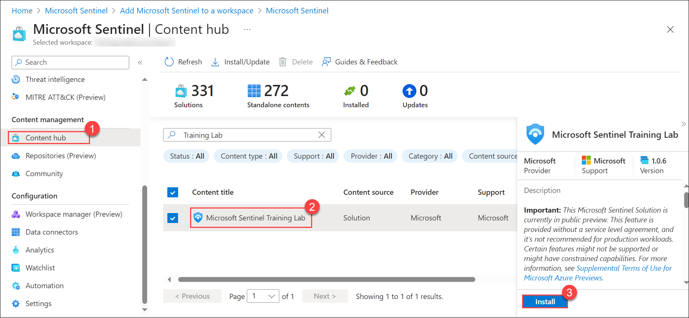
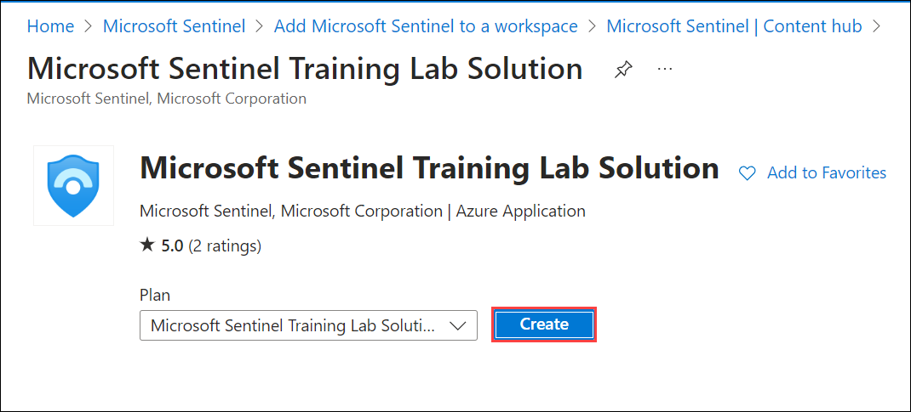
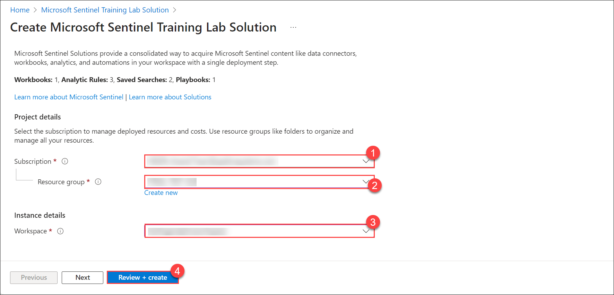

## Part:1 Lab 14 - Using Sentinel Training Lab 

## Lab scenario
In this lab you will walk through the process of creating an  Microsoft Sentinel Training Lab Solution.

## Lab objectives (Duration: 60 minutes)

In this lab, you will complete the following task:

+ Task 1: Using Sentinel Training Lab 

## Architecture diagram

## Task 1:  Using Sentinel Training Lab 

1. In Microsoft Sentinel, select the **Content hub** option in the *Content management* area.

1. From the Microsoft Sentinel page, search **Training Lab**, Select the **Microsoft Sentinel Training Lab**, click **Install**.
   
   

1. It navigate to **Microsoft Sentinel Training Lab Solution** page, Click to **Create**.
   
   

1. In the Basics tab, select the Subscription, Resource Group and Workspac, provide the details for your existing workspace. *Optionally*, review the different tabs (Workbooks, Analytics, Hunting Queries, Watchlists, Playbooks) in the solution.

   

1. Once validation is ok, click **Create**. Note that the deployment process takes **about 15 minutes**, in part because we want to make sure all the ingested data is ready for you to use once finished.

On the home page you should see some ingested data and several recent incidents. Don't worry if you don't see the incidents initially as in the screenshot below, they might take a few minutes to be raised.

     

## Review
In this lab, you will complete the following tasks:
+ Using Sentinel Training Lab 
